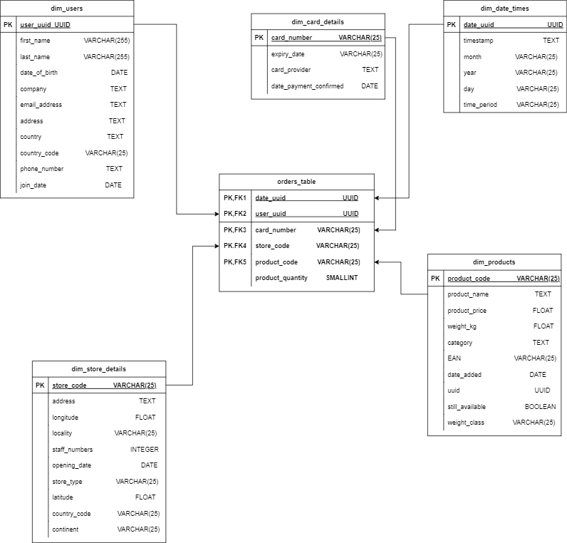

# Multinational retail data centralization 

## Table of Contents

- [Description](#description)
- [Tools and Libraries](#tools-and-libraries)
- [What I learned](#what-i-learned)
- [File Structure](#file-structure)
- [License](#license)

## Description

This project focuses on centralizing the sales data of our multinational company into a single database, enabling easy access and analysis. The primary goals include creating a unified data source, enhancing data-driven decision-making, and improving overall business intelligence.
For more information about the project kindly refer to [GitHub Wiki](https://github.com/deejay80/multinational-retail-data-centralisation/wiki)

## Tools
  ###  Technologies:
  - [PostgreSQl](#postgresql):  Robust relational database management system chosen for the project.
  - [AWS](#aws):  For cloud-based service and storage
  - [APIs](#apis):  Used for data retrieval
  ### Programming Language:
    Python
  ### Modules and Libraries:
 `Pandas`: Fast and flexible  data manipulation tool for analysis.


 `request`: Allows you to send HTTP request using Python.

 `tabula`: Enables the data extraction from PDF documents.

 `boto3`:  Amazon Web Services(AWS) software development kit(SDK) for python

 `re`:  Regular expression(or RE) can be used to check if a string contains a specified search pattern.  

 `logging`:Provide flexible framework  for emitting log messages from Python programs.

 `sqlalchemy`:  A toolkit for SQL interaction and an Object-Relational Mapping (ORM) library for database operations.

 `yaml`:  A library for working with YAML files.


### What I Learned

Throughout this project, I gained valuable experience in:

- Database design and schema creation.
- ETL process implementation for data transformation and loading.
- Knowledge expansion both in Python(`boto3`,`tabula`) and SQL.
- Querying database using regular expression for   business metrics.


### Database design
The ERD follow a star-based schema as shown below:




##  File structure
```
└── 📁ETL_scripts
       └── database_utils.py
       └── data_cleaning.py
       └── data_extraction.py
└── 📁Excel_files
       └── cleaned_card_data.csv
       └── cleaned_data.csv
       └── cleaned_date_data.csv
       └── cleaned_orders_data.csv
       └── cleaned_product_df.csv
       └── cleaned_store_data.csv
       └── cleaned_user_data.csv
       └── date_data.csv
       └── orders_data.csv
       └── product_df.csv
       └── stores_data.csv
       └── user_data.csv

└── 📁SQL_scripts
       └── m4_task1.sql
       └── m4_task2.sql
       └── m4_task3.sql
       └── m4_task4.sql
       └── m4_task5.sql
       └── m4_task6.sql
       └── m4_task7.sql
       └── m4_task8.sql
       └── m4_task9.sql
```
  

## License
This Multinational retail Database Centralisation project is released under the MIT License, which details the terms and conditions for using, modifying, and distributing the project.


